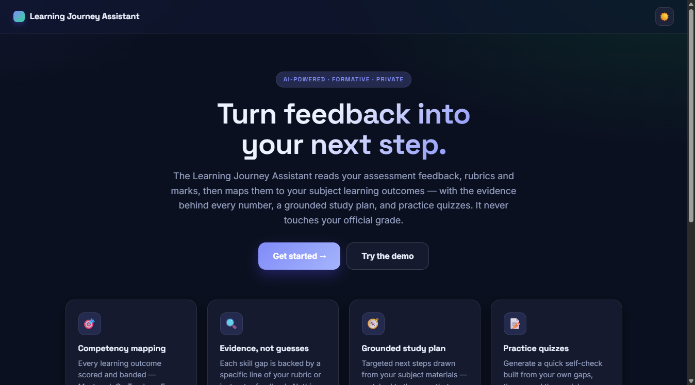
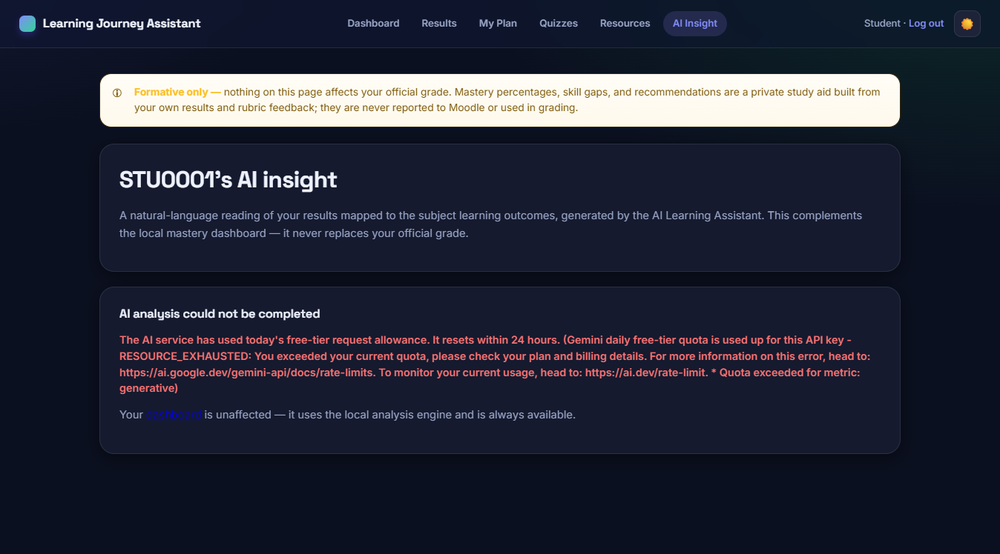
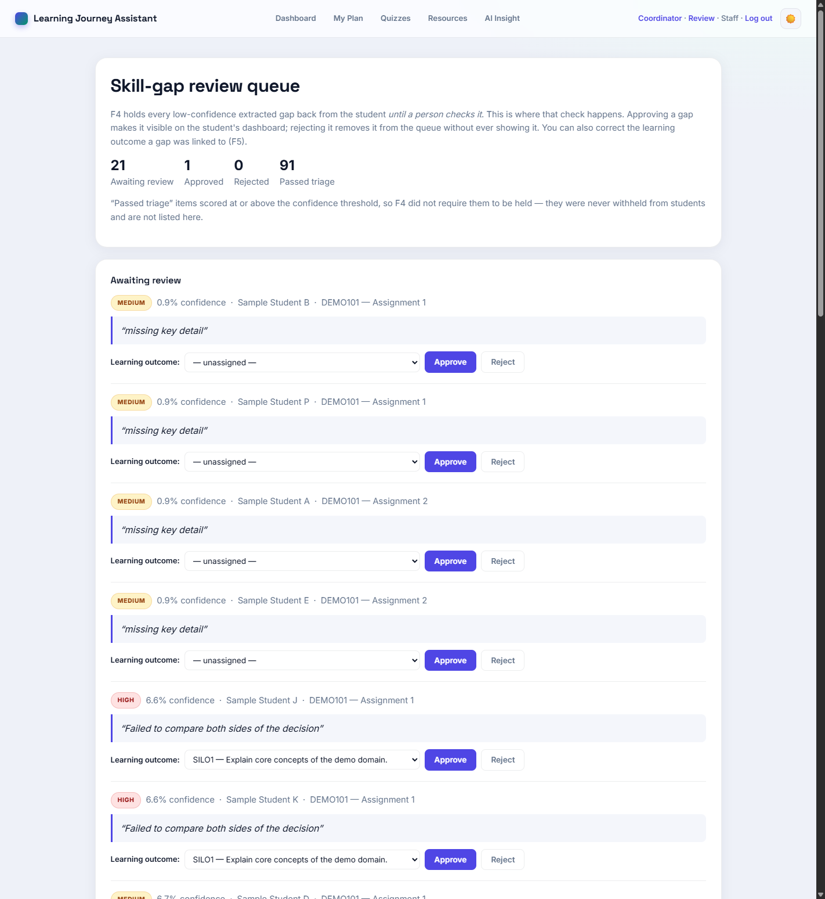

# User Guide

Learning Journey Assistant (LJAS) — CSE5IDP, team IDP_OL_G9.

This guide is for the people who *use* the app: students, and teaching
staff / coordinators. If you are setting it up or maintaining it, read
`docs/ENVIRONMENT_SETUP.md` and `docs/SYSTEM_MAINTENANCE.md` instead.

**Live app:** <https://learning-journey-assistant.onrender.com>

> **First load is slow.** The demo runs on a free hosting tier that goes
> to sleep when unused. The first request can take **50 seconds or more**
> to respond. It is not broken — give it a minute. Opening the site a few
> minutes before a demo avoids this entirely.

---

## 1. The one thing to understand first

**Nothing in this app affects your official grade.**

LJAS is *formative*. It reads your results and your rubric feedback and
turns them into a private study aid — mastery percentages, skill gaps
and recommendations. It never writes back to Moodle, never changes a
mark, and none of what you see here is reported to your teachers as an
assessment outcome. You will see this stated on a banner at the top of
every page, and that banner is not decoration — it reflects how the
system is actually built.

Your data is also **consent-gated**: if consent is not active for your
record, the system does not merely hide your results, it never computes
them in the first place.

---

## 2. Signing in

From the landing page, choose **Log in**. The sign-in form has three
roles — pick the one that applies before entering your details:

| Role | What you enter | Example (demo data) |
|---|---|---|
| **Student** | Your student number, and your password | `DEMO0001` / `DEMO0001` |
| **Staff** | Username and password | `staff` / `staff123` |
| **Admin** | Username and password | `admin` / `admin123` |

The demo accounts above exist so the app can be reviewed without real
student data. They are documented deliberately — this is an academic
demonstration, not a production identity system.

If your password is rejected, check you have the right **role** selected
first; that is the most common mistake. Every sign-in attempt, successful
or not, is recorded in an audit log.

Use **Log out** in the top-right when you are finished.

---

## 3. For students

Once signed in you land on the **Dashboard**. The navigation across the
top gives you five places to go: Dashboard, My Plan, Quizzes, Resources
and AI Insight.

### 3.1 Dashboard — where you stand

The dashboard answers "how am I doing, and where should I look first?"

- **Overall mastery** — a single percentage across everything recorded
  for you.
- **Subjects / Outcomes tracked / Need attention** — how much is being
  measured, and how many outcomes are currently flagged as weak.
- **Priority topics** — the specific learning outcomes (SILOs) to work on
  first, each with its own percentage. Start at the top of this list.
- **Subjects overview** — a mastery ring per subject, so you can see
  whether a problem is subject-wide or isolated.
- **Per-outcome cards** — below the overview, each SILO is listed with
  its mastery score. **Click a card to expand it** and see the evidence:
  which assessment results and which rubric feedback produced that
  number.

That last point is the heart of the tool. Every percentage can be traced
back to real marked work — nothing is invented, and you should be able to
ask "why is this 62%?" and get an answer.

### 3.2 My Plan — what to do next

Your study plan turns the weak outcomes into concrete next steps. Each
card covers one learning outcome and gives you a recommended activity —
for example a worked example — **grounded in your actual subject
materials**, not generated from nothing.

When you have worked through an item, press **Mark as practised**. That
records your engagement so the plan reflects what you have already done.

### 3.3 Quizzes — check yourself

Practice questions are generated from *your own* recorded skill gaps and
the closest matching passage in your topic materials. Each question is
tied to a specific outcome, so a quiz is targeted revision rather than
general trivia.

How to use it: type your answer into the box under each question, then
press **Finish & reveal answers**. The model answer for each question is
then shown so you can compare and self-rate. The point is the comparison,
not a score — nothing here is recorded against you.

Because the questions are built by matching real text rather than being
written by a language model, they cannot contain invented facts — but
they are also templated, so expect them to be straightforward rather
than creative.

### 3.4 Resources

Revision materials for the outcomes you are weakest in, drawn from the
topic materials attached to your subjects.

### 3.5 AI Insight — optional

An optional page offering a written analysis of your weaknesses.

**This is off by default.** The app's normal analysis runs entirely on a
local statistical method (TF-IDF), with no external AI service and no
cost. AI Insight is only available if the person running the deployment
has explicitly enabled and paid for an AI provider. If it is switched
off, the page simply tells you so — that is expected behaviour, not a
fault.

---

## 4. For staff and coordinators

Sign in with the **Staff** or **Admin** role. You get everything above,
plus a **Coordinator report**.

The coordinator report is a cohort-level view, not an individual one:

- Average mastery per subject and per learning outcome — useful for
  spotting an outcome the whole cohort is struggling with, which usually
  says more about the teaching or the assessment than about the students.
- Gap-severity counts across the cohort.
- An **at-risk list** — students whose average mastery is below 50%.

Two limits to be aware of, both deliberate:

1. **Consent still applies.** Students without active consent are
   excluded from every aggregate. Reporting is not a consent bypass.
2. **Access is enforced on the server.** A student cannot reach this
   report by guessing the URL.

Treat the at-risk list as a prompt for a conversation, not a judgement.
The figures are formative estimates derived from rubric feedback, not
official results.

### 4.1 Review queue — checking what students see

When the system extracts a weakness from marker feedback, it records how
confident it was. Anything below the confidence threshold is **held back
from the student until a person checks it** — and this page is where that
check happens.

Each row shows the actual line of feedback the gap came from, so you are
judging the evidence rather than taking the system's word for it, along
with the student, subject and assessment. The queue is ordered
lowest-confidence first: those are the ones the system was least sure
about, and where your judgement adds the most.

For each one you can:

- **Approve** — the gap becomes visible on that student's dashboard and
  feeds their study plan.
- **Reject** — it is discarded and never shown. It does not come back.
- **Correct the learning outcome** — pick the right SILO from the
  dropdown before deciding. Use this when the evidence is a genuine
  weakness but the system linked it to the wrong outcome.

Two things worth knowing:

- **Every decision is logged**, with who made it and any outcome you
  corrected. It is an audit trail, not a silent edit.
- **Nothing here touches a grade.** Approving a gap changes what study
  support a student sees; it does not alter any official result.

Items marked "passed triage" scored above the confidence threshold and
were never withheld, so they are not listed — you are only asked about
the ones the system itself was unsure of.

---

## 5. Troubleshooting

| What you see | What to do |
|---|---|
| The site takes ~50s to load, or seems to hang | Normal for the free tier after inactivity. Wait, then reload |
| "Invalid credentials" | Check the **role** is selected correctly; students use their student number |
| Dashboard loads but every score is empty | No data has been processed for you yet, or consent is not active for your record. Contact whoever runs the deployment |
| AI Insight says it is unavailable | Expected — the AI path is off by default (§3.5) |
| A page looks wrong on your phone | The layout is responsive, but the dashboard is densest on a larger screen; try landscape |

---

## 6. Privacy summary

- Your results and feedback are used **only** to produce your own study
  aid.
- Nothing is written back to Moodle; no official grade is ever altered.
- Data is encrypted at rest, access is checked on the server for every
  request, and significant actions are recorded in an append-only audit
  log.
- Processing is gated on active consent.
- The public demo runs on **synthetic sample data only** — no real
  student records are deployed to it.

For the field-by-field detail of what is stored, see
`docs/DATA_DICTIONARY.md`.
