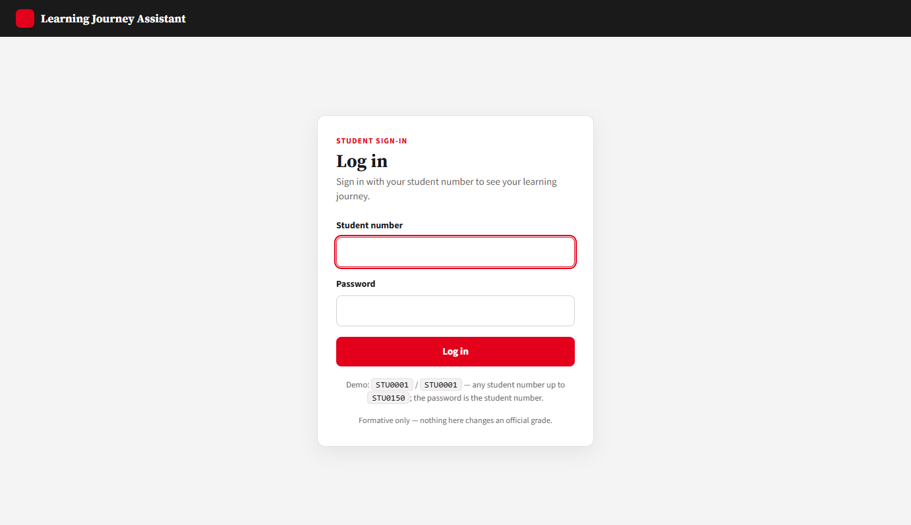
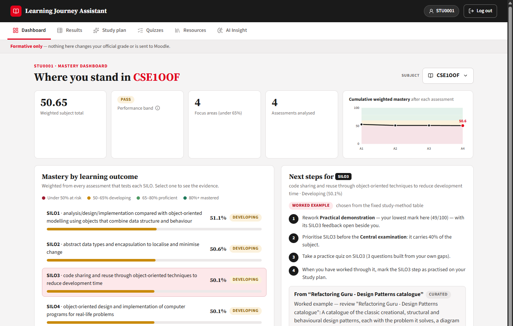
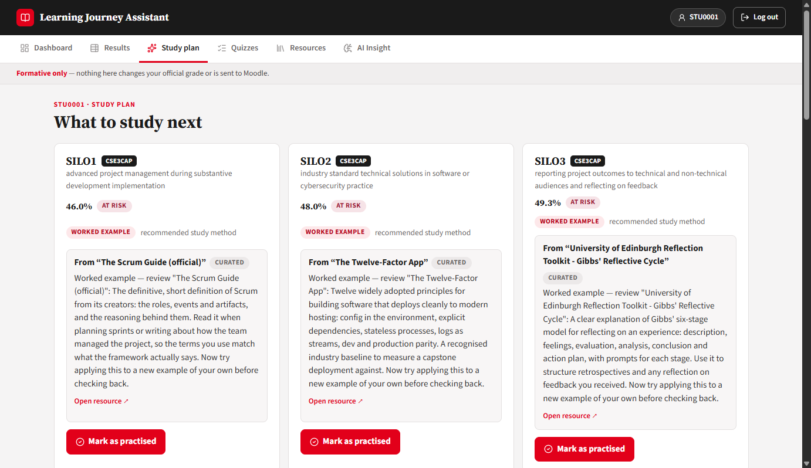
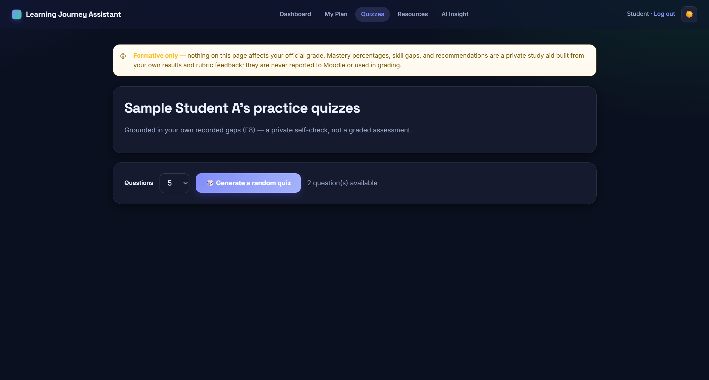
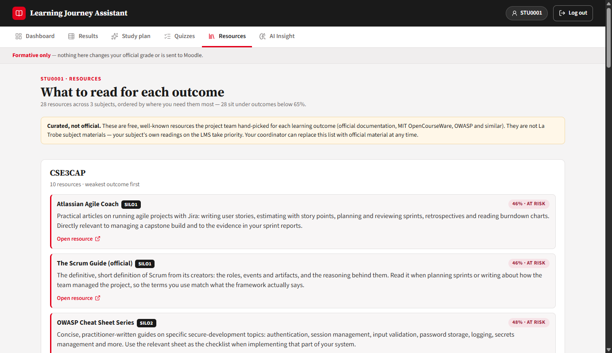
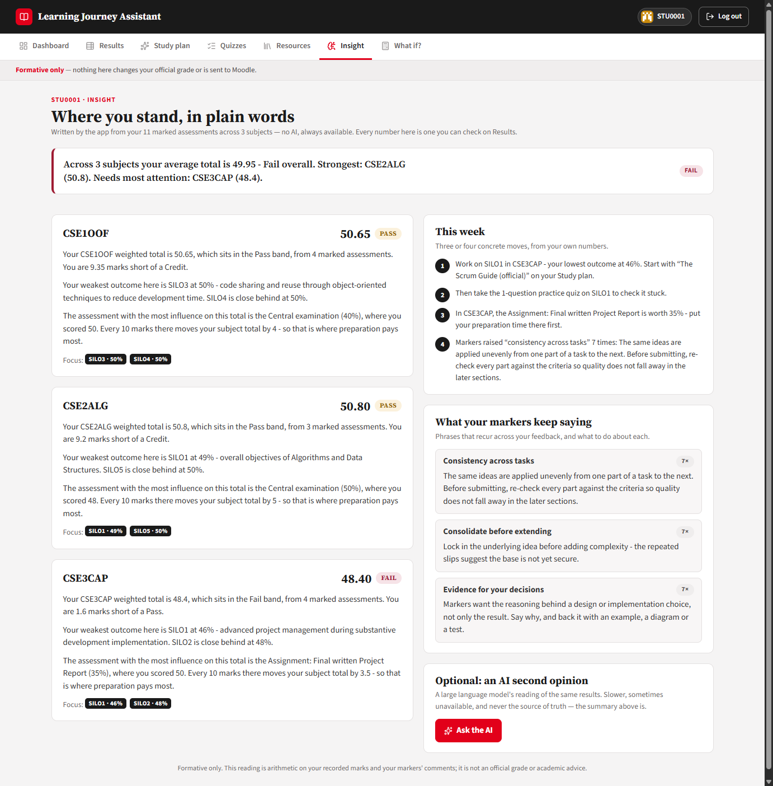
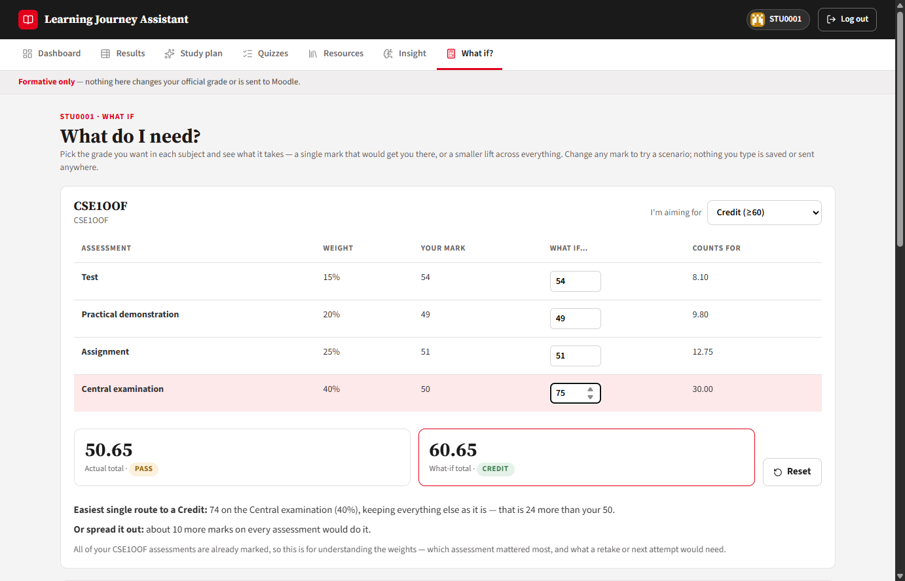

# User Guide

Learning Journey Assistant (LJAS) — CSE5IDP, team IDP_OL_G9.

This guide is for the people who *use* the app: students. If you are
setting it up or maintaining it, read `docs/RUN_IN_VSCODE.md`,
`docs/ENVIRONMENT_SETUP.md` and `docs/SYSTEM_MAINTENANCE.md` instead.

**Live app:** <https://learning-journey-assistant.onrender.com>

> **First load is slow.** The demo runs on a free hosting tier that goes
> to sleep when unused, and it rebuilds all 150 students when it wakes. The
> first request can take **1–3 minutes**. It is not broken — give it a
> moment. Opening the site a few minutes before a demo avoids this.

---

## 1. The one thing to understand first

**Nothing in this app affects your official grade.**

LJAS is *formative*. It reads your results and your marker feedback and
turns them into a private study aid — mastery percentages, skill gaps
and recommendations. It never writes back to Moodle, never changes a
mark, and none of what you see here is reported to your teachers as an
assessment outcome. You will see this stated on a banner at the top of
every page, and that banner is not decoration — it reflects how the
system is actually built.

Your data is also **consent-gated**: if consent is not active for your
record, the system does not merely hide your results, it never computes
them in the first place.

---

## 2. Signing in

Opening the app takes you to the sign-in page. Enter your student number
and password.

| Where | Student number | Password |
|---|---|---|
| Live demo (150-student dataset) | `STU0001` — any of `STU0001` to `STU0150` | Same as the student number |
| A fresh local copy without the dataset | `DEMO0001` | `DEMO0001` |

The app is **student-only** — there are no staff or administrator
accounts. The demo passwords are documented deliberately: this is an
academic demonstration, not a production identity system.

Every sign-in attempt, successful or not, is recorded in an audit log.
Use **Log out** in the top-right when you are finished.

---

## 3. Using the app

Once signed in you land on the **Dashboard**. The navigation across the
top (or the menu button on a phone) gives you six places to go:
Dashboard, Results, Study and Insight. Study has three sections — Plan,
Quizzes and Resources — and Insight has two — Where I stand and What if?.
The Dashboard opens with a **Today** strip: a gauge of the subject closest to
its next grade band, the assessment that moves it most, and the first step
to take. On a phone the four tabs sit in a bar at the bottom of the screen.

**Light or dark:** the app follows your device setting; the sun/moon button
in the header switches it, and the choice is remembered in that browser.

### 3.1 Dashboard — where you stand

The dashboard answers "how am I doing, and where should I look first?"

- **Subject picker** — switch between your subjects, top right.
- **Summary row** — the weighted subject total, its performance band
  (Fail, Pass, Credit, Distinction, High Distinction), how many outcomes
  are focus areas, and a chart of your mastery after each assessment.
- **Mastery by learning outcome** — a coloured bar per SILO: at risk,
  developing, proficient or mastered.
- **Evidence** — select an outcome to see every assessment that tests it,
  with its weight, score and feedback, and the calculation behind the
  percentage.
- **Next steps** and **Priority topics** — what to do for the selected
  outcome, and your weakest outcomes across every subject.

Each outcome's mastery is the **weighted average** of the assessments that
test it, using each assessment's weight — so a 40% exam counts for more
than a 15% test. Every percentage can be traced back to real marked work;
nothing is invented, and you should be able to ask "why is this 51%?" and
get an answer.

### 3.2 Results — every result in one place

The Results page shows each of your subjects as a table, with one row per
assessment:

| Column | Meaning |
|---|---|
| **Assessment Type** | Which assessment, e.g. *CSE1OOF - Central examination* |
| **Score (1-100)** | Your mark |
| **Feedback Comment** | The marker's feedback, word for word |
| **SILO's** | The learning outcomes that assessment covers |
| **Weight** | How much the assessment counts towards the subject total |
| **Weighted Score** | Your score × the weight |

The **Weighted total** next to each subject name adds up the weighted
scores — it is your subject total.

### 3.3 Study plan — what to do next

Your study plan turns weak outcomes into next steps. Each card covers one
learning outcome and recommends a study method — a worked example,
retrieval practice or spaced practice — chosen from a fixed table.

Study material is only ever **taken from real resources**, never
generated. The 150-student dataset ships with no La Trobe subject material,
so each card points to a resource from the team's curated list (see 3.5)
for that learning outcome, with a link to open it. Cards from the curated
list carry a small **curated** label. Where a subject has nothing loaded at
all, the card says so and flags it for the coordinator rather than inventing
something.

When you have worked through an item, press **Mark as practised**. That
records your engagement and gives a small, capped boost to that outcome's
estimate next time scores are calculated.

### 3.4 Quizzes — check yourself

Practice questions are generated from *your own* recorded skill gaps, so a
quiz is targeted revision rather than general trivia.

Type your answer into the box under each question, then press **Finish &
reveal answers**. The model answer for each question is shown so you can
compare and self-rate. Nothing here is marked or recorded against you.

Because the questions are templated from real text rather than written by
a language model, they cannot contain invented facts — but expect them to
be straightforward rather than creative.

### 3.5 Resources

Reading for each learning outcome, grouped by subject and **ordered by
where you need it most**: resources for your weakest outcomes come first,
each showing your current mastery band, and outcomes under 65% are marked
with a red edge.

The list is **curated, not official**. Because the dataset includes no La
Trobe subject material, the project team hand-picked free, well-known
resources for every SILO — official language documentation, MIT
OpenCourseWare, the Princeton Algorithms booksite, OWASP, the Scrum Guide
and similar. Each card says what the resource covers and how to use it for
that outcome, and **Open resource** opens it in a new tab on the
publisher's site. Your subject's own readings on the LMS always take
priority; a coordinator can replace the curated list with official material
at any time (System Maintenance Document §9).

### 3.6 Insight — where you stand, in plain words

A written reading of your results, composed by the app from your own
marks — **no AI involved, so it is always available**. It gives you:

- a one-line headline across your subjects (average total, band, strongest
  and weakest subject);
- for each subject, a short paragraph: your weighted total and band, how
  far you are from the next band, your weakest outcome, and which
  assessment carries the most weight ("every 10 marks there moves your
  total by 4");
- **This week** — three or four concrete steps built from your lowest
  outcome, its resource, its quiz and your weakest subject's heaviest
  assessment;
- **What your markers keep saying** — phrases that recur across your
  feedback comments, how often, and what to do about each.

Every sentence is arithmetic on numbers you can check on Results.

At the bottom, **Optional: an AI second opinion** lets you ask a large
language model for its reading of the same results. It is slower, gives up
after 30 seconds, and can be unavailable when the free daily quota is used
up — none of which affects the written insight above it.

### 3.7 What if? — "what do I need?"

For each subject, pick the grade you are aiming for (Pass, Credit,
Distinction, High Distinction). The page shows:

- your **actual total** next to a **what-if total** that updates as you
  type different marks into any assessment;
- the **easiest single route** — the one mark on one assessment that would
  get you there with everything else unchanged, and how many more marks
  that is than you got;
- **or spread it out** — the smaller lift needed on every assessment.

Assessments not yet marked are flagged, so you can type an expected mark
and see where it lands you. Nothing you type is saved or sent anywhere.
Bands use La Trobe's thresholds on the weighted total; official grades may
include hurdles and moderation the calculator does not know about.

---

## 4. Troubleshooting

| What you see | What to do |
|---|---|
| The site takes 1–3 minutes to load | Normal after inactivity on the free tier. Wait, then reload |
| "Incorrect student number or password" | Use your student number as both fields on the demo, e.g. `STU0001` / `STU0001`. `DEMO0001` only exists on a local copy without the dataset |
| "Forbidden" | You tried to open another student's record. You can only see your own |
| Dashboard loads but every score is empty | Your results have not been processed yet, or consent is not active for your record |
| The optional AI second opinion on Insight shows a message instead of an analysis | Expected when AI is off, the daily free quota is used up, or it took longer than 30 seconds. The written insight above it never depends on AI (§3.6) |
| A page looks cramped on your phone | The layout is responsive, but the dashboard is easiest to read on a larger screen or in landscape |

---

## 5. Privacy summary

- Your results and feedback are used **only** to produce your own study
  aid, and only you can see your record.
- Nothing is written back to Moodle; no official grade is ever altered.
- Personal details are encrypted at rest, access is checked on the server
  for every request, and significant actions are recorded in an
  append-only audit log.
- Processing is gated on active consent.
- If AI Insight is enabled, your feedback text is sent to the AI provider
  to generate the analysis.
- The live demo uses the subject's **anonymised** 150-student dataset
  (student numbers only, no names), approved for this use by the subject
  coordinator.

For the field-by-field detail of what is stored, see
`docs/DATA_DICTIONARY.md`.
